# PromotionOS — System Architecture

> AI-assisted Trade Promotions Management Platform
> SaaS Challenger to Oracle Trade Management
> Designed for: Full DDD | SaaS-ready | AI/ML-ready | Event-sourced

---

## Ubiquitous Language

| Term | Definition |
|------|-----------|
| **Tenant** | A retail organization using PromotionOS (e.g. Kroger, Walmart) |
| **Campaign** | The business intent behind a promotion |
| **Offer** | The customer-facing expression of a campaign |
| **Funding** | Vendor/Kroger split agreement backing a campaign |
| **Budget** | The financial cap on a campaign |
| **Segment** | A group of customers sharing qualifying criteria |
| **Eligibility** | The rules determining if a customer qualifies |
| **Stack** | Two or more offers applying to the same transaction |
| **Exclusion** | Products/customers explicitly outside an offer's scope |
| **Threshold** | Minimum condition to trigger an offer (spend $50, buy 3) |
| **Redemption** | A confirmed application of an offer to a transaction |
| **Claim** | A vendor reimbursement request post-redemption |
| **Lift** | Incremental sales attributed to a campaign |
| **Deduction** | Vendor payment withheld to settle a claim |

---

## DDD Building Blocks

Each bounded context follows the same internal structure:

```
Controller (HTTP in)
    └── Application Service (orchestrates)
            ├── Aggregate Root (domain logic, raises events)
            │       ├── Entities (identity, mutable)
            │       └── Value Objects (immutable, no identity)
            ├── Domain Service (logic spanning aggregates)
            ├── Repository Interface (domain layer contract)
            │       └── Repository Implementation (infrastructure)
            └── Domain Event (raised by aggregate, published after commit)
```

### Value Objects used across contexts

| Value Object | Fields | Context |
|-------------|--------|---------|
| `Money` | amount, currency | Campaign, Redemption |
| `DateRange` | startDate, endDate | Campaign, Eligibility |
| `Percentage` | value (0-100) | Campaign, Analytics |
| `TenantId` | uuid | All contexts |
| `CustomerId` | uuid | Eligibility, Redemption |
| `UPC` | code (string) | Catalog, Eligibility |
| `LoyaltyTier` | BASIC, SILVER, GOLD, PLATINUM | Customer, Eligibility |

---

## C1 — System Context

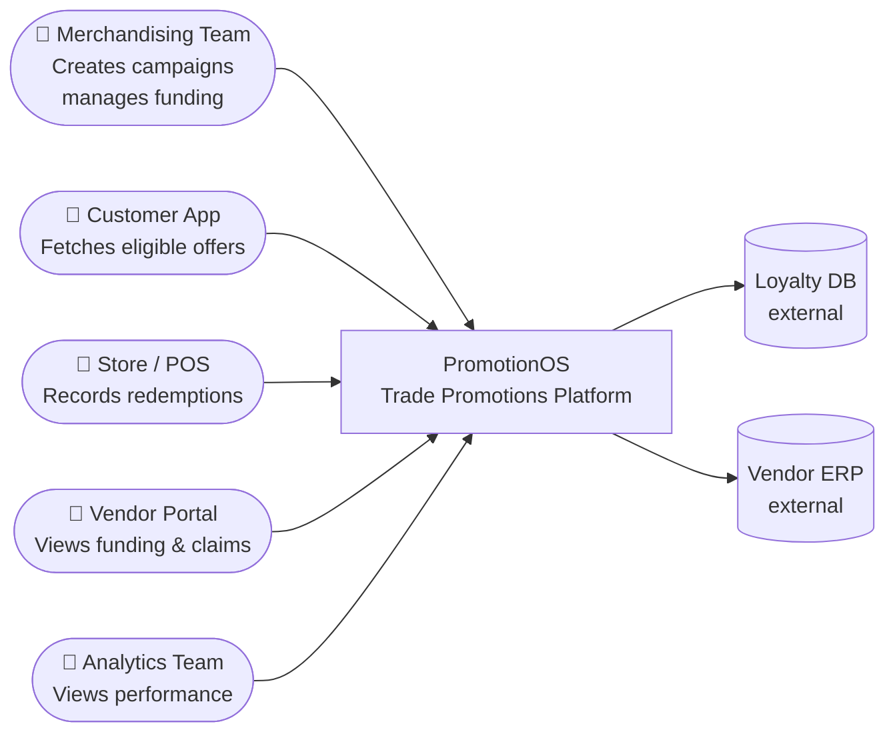
```mermaid
graph LR
    MX(["👤 Merchandising Team\nCreates campaigns\nmanages funding"])
    CX(["👤 Customer App\nFetches eligible offers"])
    POS(["👤 Store / POS\nRecords redemptions"])
    VP(["👤 Vendor Portal\nViews funding & claims"])
    AT(["👤 Analytics Team\nViews performance"])

    PROMO["PromotionOS\nTrade Promotions Platform"]

    LOYALTY[("Loyalty DB\nexternal")]
    VERP[("Vendor ERP\nexternal")]

    MX --> PROMO
    CX --> PROMO
    POS --> PROMO
    VP --> PROMO
    AT --> PROMO

    PROMO --> LOYALTY
    PROMO --> VERP
```

---

## C2 — Container Diagram

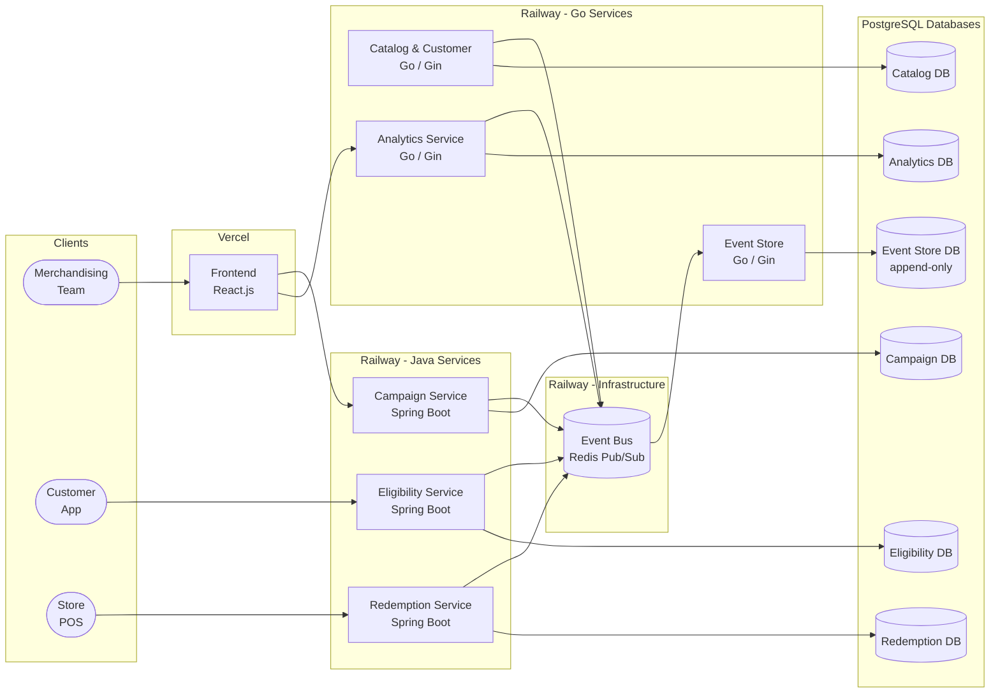
```mermaid
graph LR
    subgraph Clients
        MX(["Merchandising\nTeam"])
        CX(["Customer\nApp"])
        POS(["Store\nPOS"])
    end

    subgraph Vercel
        FE["Frontend\nReact.js"]
    end

    subgraph Railway - Java Services
        CS["Campaign Service\nSpring Boot"]
        ES["Eligibility Service\nSpring Boot"]
        RS["Redemption Service\nSpring Boot"]
    end

    subgraph Railway - Go Services
        CCS["Catalog & Customer\nGo / Gin"]
        AS["Analytics Service\nGo / Gin"]
        EVS["Event Store\nGo / Gin"]
    end

    subgraph Railway - Infrastructure
        EB[("Event Bus\nRedis Pub/Sub")]
    end

    subgraph PostgreSQL Databases
        DB1[("Campaign DB")]
        DB2[("Eligibility DB")]
        DB3[("Catalog DB")]
        DB4[("Redemption DB")]
        DB5[("Analytics DB")]
        DB6[("Event Store DB\nappend-only")]
    end

    MX --> FE
    CX --> ES
    POS --> RS

    FE --> CS
    FE --> AS

    CS --> EB
    ES --> EB
    RS --> EB
    CCS --> EB
    AS --> EB

    EB --> EVS

    CS --> DB1
    ES --> DB2
    CCS --> DB3
    RS --> DB4
    AS --> DB5
    EVS --> DB6
```

---

## C3 — Component Diagrams

### Campaign Service — Spring Boot

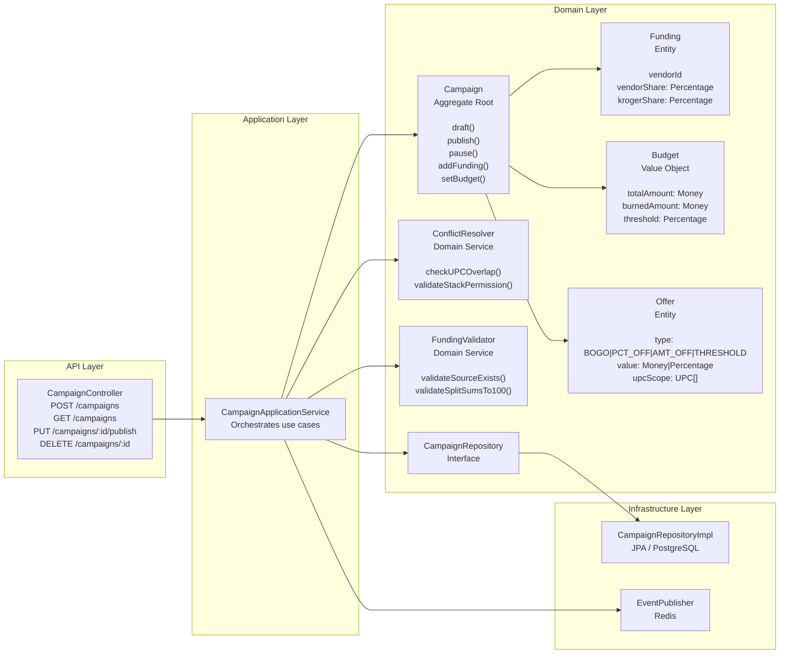
```mermaid
graph LR
    subgraph API Layer
        CC["CampaignController\nPOST /campaigns\nGET /campaigns\nPUT /campaigns/:id/publish\nDELETE /campaigns/:id"]
    end

    subgraph Application Layer
        CAS["CampaignApplicationService\nOrchestrates use cases"]
    end

    subgraph Domain Layer
        CAG["Campaign\nAggregate Root\n\ndraft()\npublish()\npause()\naddFunding()\nsetBudget()"]
        FUND["Funding\nEntity\n\nvendorId\nvendorShare: Percentage\nkrogerShare: Percentage"]
        BUDGET["Budget\nValue Object\n\ntotalAmount: Money\nburnedAmount: Money\nthreshold: Percentage"]
        OFFER["Offer\nEntity\n\ntype: BOGO|PCT_OFF|AMT_OFF|THRESHOLD\nvalue: Money|Percentage\nupcScope: UPC[]"]
        CR["ConflictResolver\nDomain Service\n\ncheckUPCOverlap()\nvalidateStackPermission()"]
        FV["FundingValidator\nDomain Service\n\nvalidateSourceExists()\nvalidateSplitSumsTo100()"]
        CREP["CampaignRepository\nInterface"]
    end

    subgraph Infrastructure Layer
        CREPI["CampaignRepositoryImpl\nJPA / PostgreSQL"]
        EP["EventPublisher\nRedis"]
    end

    CC --> CAS
    CAS --> CAG
    CAS --> CR
    CAS --> FV
    CAG --> FUND
    CAG --> BUDGET
    CAG --> OFFER
    CAS --> CREP
    CREP --> CREPI
    CAS --> EP
```

---

### Eligibility Service — Spring Boot

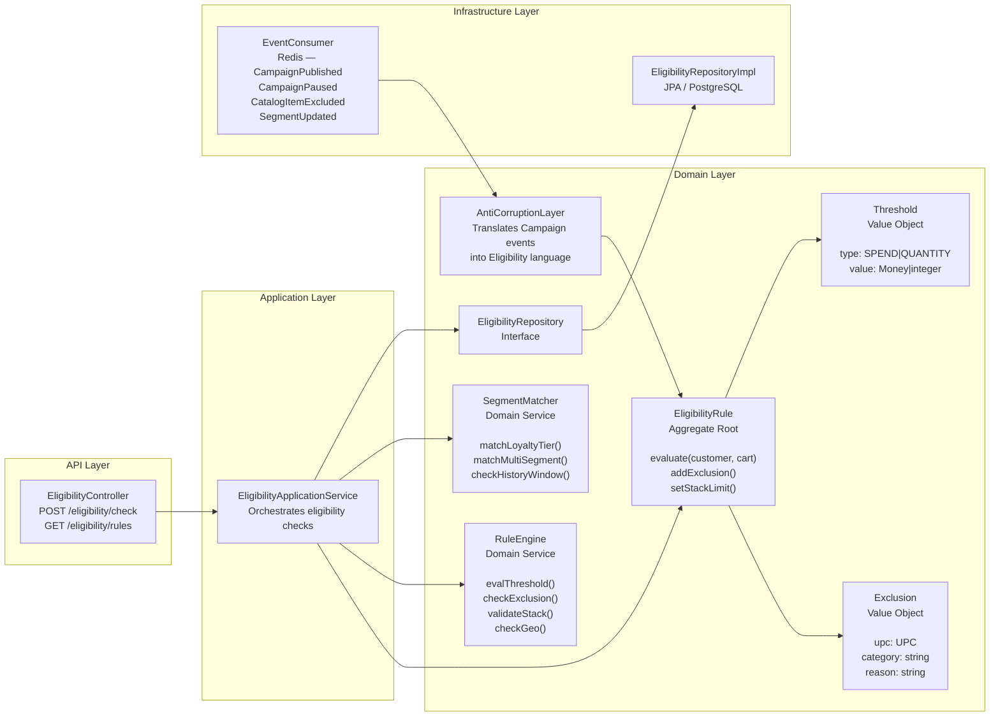
```mermaid
graph LR
    subgraph API Layer
        EC["EligibilityController\nPOST /eligibility/check\nGET /eligibility/rules"]
    end

    subgraph Application Layer
        EAS["EligibilityApplicationService\nOrchestrates eligibility checks"]
    end

    subgraph Domain Layer
        EAG["EligibilityRule\nAggregate Root\n\nevaluate(customer, cart)\naddExclusion()\nsetStackLimit()"]
        RE["RuleEngine\nDomain Service\n\nevalThreshold()\ncheckExclusion()\nvalidateStack()\ncheckGeo()"]
        SM["SegmentMatcher\nDomain Service\n\nmatchLoyaltyTier()\nmatchMultiSegment()\ncheckHistoryWindow()"]
        EXCL["Exclusion\nValue Object\n\nupc: UPC\ncategory: string\nreason: string"]
        THRESH["Threshold\nValue Object\n\ntype: SPEND|QUANTITY\nvalue: Money|integer"]
        ACL["AntiCorruptionLayer\nTranslates Campaign events\ninto Eligibility language"]
        EREP["EligibilityRepository\nInterface"]
    end

    subgraph Infrastructure Layer
        EREPI["EligibilityRepositoryImpl\nJPA / PostgreSQL"]
        EC2["EventConsumer\nRedis — CampaignPublished\nCampaignPaused\nCatalogItemExcluded\nSegmentUpdated"]
    end

    EC --> EAS
    EAS --> EAG
    EAS --> RE
    EAS --> SM
    EAG --> EXCL
    EAG --> THRESH
    EC2 --> ACL
    ACL --> EAG
    EAS --> EREP
    EREP --> EREPI
```

---

### Redemption Service — Spring Boot

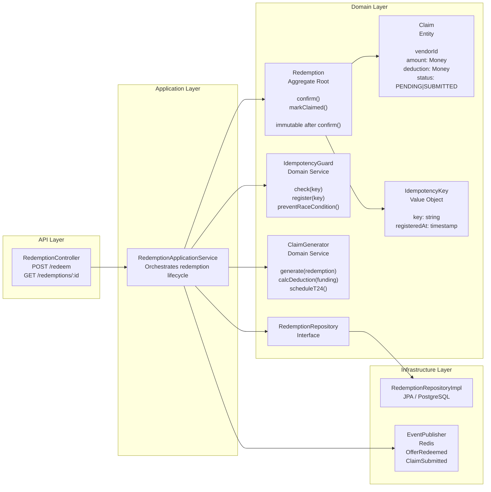
```mermaid
graph LR
    subgraph API Layer
        RC["RedemptionController\nPOST /redeem\nGET /redemptions/:id"]
    end

    subgraph Application Layer
        RAS["RedemptionApplicationService\nOrchestrates redemption lifecycle"]
    end

    subgraph Domain Layer
        RAG["Redemption\nAggregate Root\n\nconfirm()\nmarkClaimed()\n\nimmutable after confirm()"]
        IG["IdempotencyGuard\nDomain Service\n\ncheck(key)\nregister(key)\npreventRaceCondition()"]
        CG["ClaimGenerator\nDomain Service\n\ngenerate(redemption)\ncalcDeduction(funding)\nscheduleT24()"]
        CLAIM["Claim\nEntity\n\nvendorId\namount: Money\ndeduction: Money\nstatus: PENDING|SUBMITTED"]
        IKEY["IdempotencyKey\nValue Object\n\nkey: string\nregisteredAt: timestamp"]
        RREP["RedemptionRepository\nInterface"]
    end

    subgraph Infrastructure Layer
        RREPI["RedemptionRepositoryImpl\nJPA / PostgreSQL"]
        EP["EventPublisher\nRedis\nOfferRedeemed\nClaimSubmitted"]
    end

    RC --> RAS
    RAS --> IG
    RAS --> RAG
    RAS --> CG
    RAG --> CLAIM
    RAG --> IKEY
    RAS --> RREP
    RREP --> RREPI
    RAS --> EP
```

---

### Catalog & Customer Service — Go / Gin

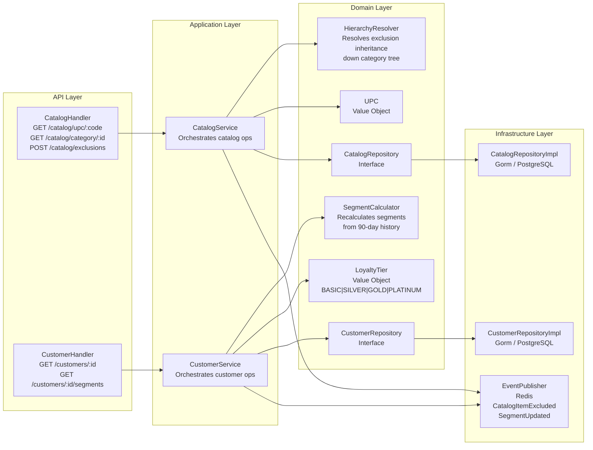
```mermaid
graph LR
    subgraph API Layer
        CATC["CatalogHandler\nGET /catalog/upc/:code\nGET /catalog/category/:id\nPOST /catalog/exclusions"]
        CUSC["CustomerHandler\nGET /customers/:id\nGET /customers/:id/segments"]
    end

    subgraph Application Layer
        CATA["CatalogService\nOrchestrates catalog ops"]
        CUSA["CustomerService\nOrchestrates customer ops"]
    end

    subgraph Domain Layer
        HIER["HierarchyResolver\nResolves exclusion inheritance\ndown category tree"]
        SEGC["SegmentCalculator\nRecalculates segments\nfrom 90-day history"]
        UPC["UPC\nValue Object"]
        TIER["LoyaltyTier\nValue Object\nBASIC|SILVER|GOLD|PLATINUM"]
        CATREP["CatalogRepository\nInterface"]
        CUSREP["CustomerRepository\nInterface"]
    end

    subgraph Infrastructure Layer
        CATREPI["CatalogRepositoryImpl\nGorm / PostgreSQL"]
        CUSREPI["CustomerRepositoryImpl\nGorm / PostgreSQL"]
        EP["EventPublisher\nRedis\nCatalogItemExcluded\nSegmentUpdated"]
    end

    CATC --> CATA
    CUSC --> CUSA
    CATA --> HIER
    CATA --> UPC
    CUSA --> SEGC
    CUSA --> TIER
    CATA --> CATREP
    CUSA --> CUSREP
    CATREP --> CATREPI
    CUSREP --> CUSREPI
    CATA --> EP
    CUSA --> EP
```

---

### Analytics Service — Go / Gin

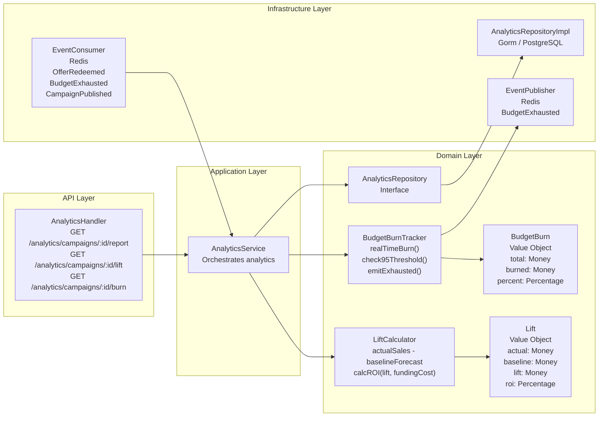
```mermaid
graph LR
    subgraph API Layer
        AC["AnalyticsHandler\nGET /analytics/campaigns/:id/report\nGET /analytics/campaigns/:id/lift\nGET /analytics/campaigns/:id/burn"]
    end

    subgraph Application Layer
        AAS["AnalyticsService\nOrchestrates analytics"]
    end

    subgraph Domain Layer
        LC["LiftCalculator\nactualSales - baselineForecast\ncalcROI(lift, fundingCost)"]
        BT["BudgetBurnTracker\nrealTimeBurn()\ncheck95Threshold()\nemitExhausted()"]
        LIFT["Lift\nValue Object\nactual: Money\nbaseline: Money\nlift: Money\nroi: Percentage"]
        BURN["BudgetBurn\nValue Object\ntotal: Money\nburned: Money\npercent: Percentage"]
        AREP["AnalyticsRepository\nInterface"]
    end

    subgraph Infrastructure Layer
        AREPI["AnalyticsRepositoryImpl\nGorm / PostgreSQL"]
        EC["EventConsumer\nRedis\nOfferRedeemed\nBudgetExhausted\nCampaignPublished"]
        EP["EventPublisher\nRedis\nBudgetExhausted"]
    end

    AC --> AAS
    AAS --> LC
    AAS --> BT
    LC --> LIFT
    BT --> BURN
    EC --> AAS
    AAS --> AREP
    AREP --> AREPI
    BT --> EP
```

---

### Event Store — Go / Gin

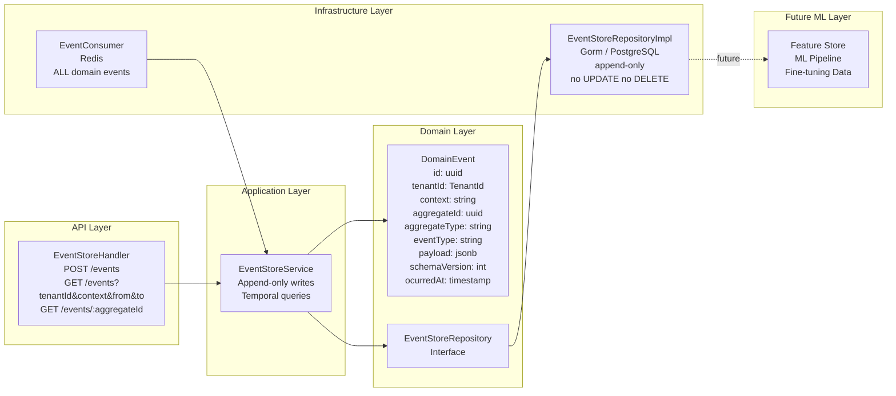
```mermaid
graph LR
    subgraph API Layer
        ESC["EventStoreHandler\nPOST /events\nGET /events?tenantId&context&from&to\nGET /events/:aggregateId"]
    end

    subgraph Application Layer
        ESS["EventStoreService\nAppend-only writes\nTemporal queries"]
    end

    subgraph Domain Layer
        DE["DomainEvent\nid: uuid\ntenantId: TenantId\ncontext: string\naggregateId: uuid\naggregateType: string\neventType: string\npayload: jsonb\nschemaVersion: int\nocurredAt: timestamp"]
        ESREP["EventStoreRepository\nInterface"]
    end

    subgraph Infrastructure Layer
        ESREPI["EventStoreRepositoryImpl\nGorm / PostgreSQL\nappend-only\nno UPDATE no DELETE"]
        EC["EventConsumer\nRedis\nALL domain events"]
    end

    subgraph Future ML Layer
        FML["Feature Store\nML Pipeline\nFine-tuning Data"]
    end

    ESC --> ESS
    EC --> ESS
    ESS --> DE
    ESS --> ESREP
    ESREP --> ESREPI
    ESREPI -.->|future| FML
```

---

### Frontend — React.js

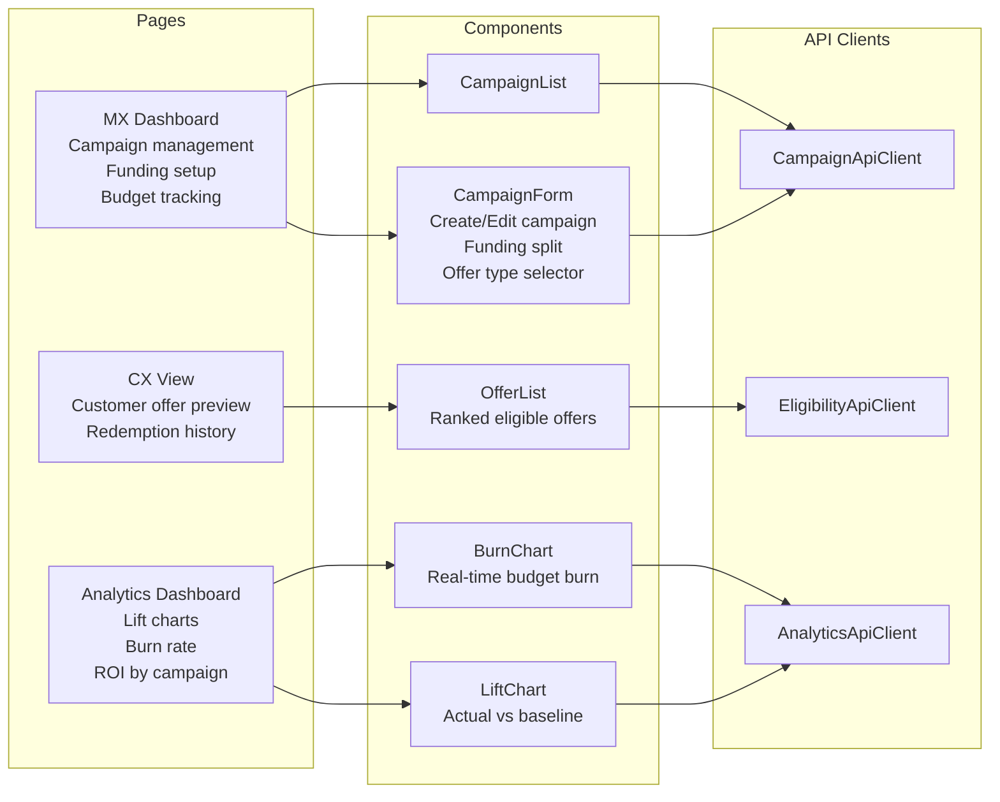
```mermaid
graph LR
    subgraph Pages
        MP["MX Dashboard\nCampaign management\nFunding setup\nBudget tracking"]
        CP["CX View\nCustomer offer preview\nRedemption history"]
        AP["Analytics Dashboard\nLift charts\nBurn rate\nROI by campaign"]
    end

    subgraph Components
        CL["CampaignList"]
        CF["CampaignForm\nCreate/Edit campaign\nFunding split\nOffer type selector"]
        OL["OfferList\nRanked eligible offers"]
        BC["BurnChart\nReal-time budget burn"]
        LC["LiftChart\nActual vs baseline"]
    end

    subgraph API Clients
        CSC["CampaignApiClient"]
        ESC["EligibilityApiClient"]
        ASC["AnalyticsApiClient"]
    end

    MP --> CL
    MP --> CF
    CP --> OL
    AP --> BC
    AP --> LC

    CL --> CSC
    CF --> CSC
    OL --> ESC
    BC --> ASC
    LC --> ASC
```

---

## Domain Events Catalog

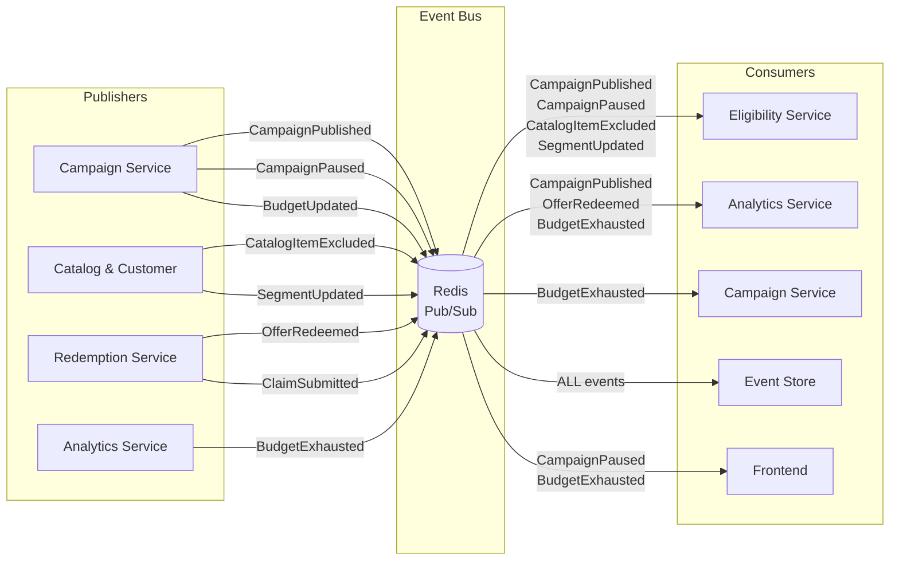
```mermaid
graph LR
    subgraph Publishers
        CS["Campaign Service"]
        CCS["Catalog & Customer"]
        RS["Redemption Service"]
        AS["Analytics Service"]
    end

    subgraph Event Bus
        EB[("Redis\nPub/Sub")]
    end

    subgraph Consumers
        ES["Eligibility Service"]
        AS2["Analytics Service"]
        CS2["Campaign Service"]
        EVS["Event Store"]
        FE["Frontend"]
    end

    CS -->|CampaignPublished| EB
    CS -->|CampaignPaused| EB
    CS -->|BudgetUpdated| EB
    CCS -->|CatalogItemExcluded| EB
    CCS -->|SegmentUpdated| EB
    RS -->|OfferRedeemed| EB
    RS -->|ClaimSubmitted| EB
    AS -->|BudgetExhausted| EB

    EB -->|CampaignPublished\nCampaignPaused\nCatalogItemExcluded\nSegmentUpdated| ES
    EB -->|CampaignPublished\nOfferRedeemed\nBudgetExhausted| AS2
    EB -->|BudgetExhausted| CS2
    EB -->|ALL events| EVS
    EB -->|CampaignPaused\nBudgetExhausted| FE
```

---

## Bounded Context Map

```mermaid
graph LR
    subgraph Campaign Context
        CAM["Campaign\nAggregate Root"]
        FUND2["Funding Entity"]
        BUDG["Budget Value Object"]
        OFF["Offer Entity"]
        CAM --- FUND2
        CAM --- BUDG
        CAM --- OFF
    end

    subgraph Eligibility Context
        ERUL["EligibilityRule\nAggregate Root"]
        RENG["Rule Engine"]
        SMATCH["Segment Matcher"]
        EACL["ACL\n← Campaign\n← Catalog\n← Customer"]
        ERUL --- RENG
        ERUL --- SMATCH
        EACL --> ERUL
    end

    subgraph Catalog Context
        UPCN["UPC Value Object"]
        CATN["Category Entity"]
        HIERN["Hierarchy Resolver"]
        CATN --- UPCN
        CATN --- HIERN
    end

    subgraph Customer Context
        CUSTN["Customer\nAggregate Root"]
        TIERN["LoyaltyTier\nValue Object"]
        SEGCALC["Segment Calculator"]
        CUSTN --- TIERN
        CUSTN --- SEGCALC
    end

    subgraph Redemption Context
        REDN["Redemption\nAggregate Root"]
        CLAIMN["Claim Entity"]
        IDGN["Idempotency Guard"]
        REDN --- CLAIMN
        REDN --- IDGN
    end

    subgraph Analytics Context
        LIFTN["Lift Calculator"]
        BURNN["Budget Burn Tracker"]
        ROIN["ROI Calculator"]
    end

    subgraph Event Store
        EVN["DomainEvent\nAppend-only"]
    end

    Campaign Context -->|CampaignPublished\nvia ACL| Eligibility Context
    Catalog Context -->|CatalogItemExcluded\nvia ACL| Eligibility Context
    Customer Context -->|SegmentUpdated\nvia ACL| Eligibility Context
    Eligibility Context -->|EligibilityChecked| Redemption Context
    Redemption Context -->|OfferRedeemed| Analytics Context
    Analytics Context -->|BudgetExhausted| Campaign Context
    Campaign Context -->|ALL events| Event Store
    Eligibility Context -->|ALL events| Event Store
    Redemption Context -->|ALL events| Event Store
    Analytics Context -->|ALL events| Event Store
```

---

## Sequence Diagrams

### Sequence 1 — Campaign Creation and Publish

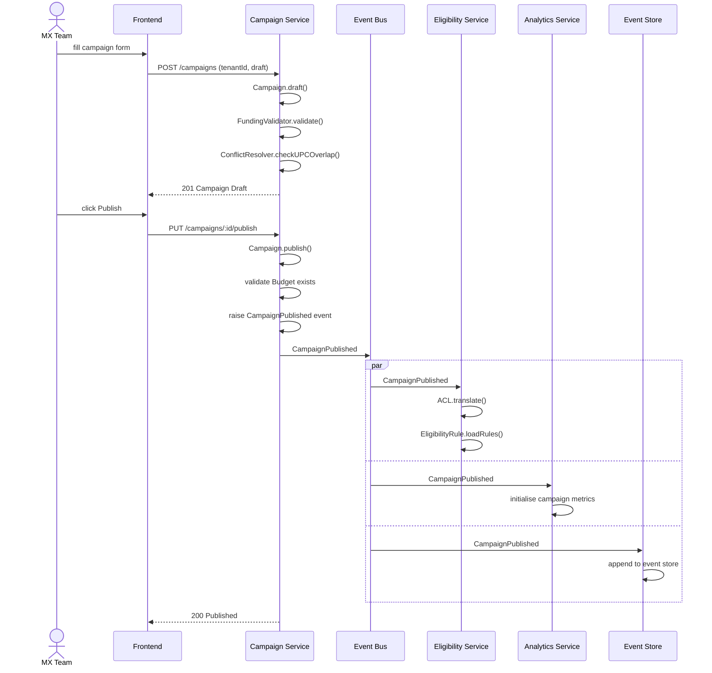
```mermaid
sequenceDiagram
    actor MX as MX Team
    participant FE as Frontend
    participant CS as Campaign Service
    participant EB as Event Bus
    participant ES as Eligibility Service
    participant AS as Analytics Service
    participant EVS as Event Store

    MX->>FE: fill campaign form
    FE->>CS: POST /campaigns (tenantId, draft)
    CS->>CS: Campaign.draft()
    CS->>CS: FundingValidator.validate()
    CS->>CS: ConflictResolver.checkUPCOverlap()
    CS-->>FE: 201 Campaign Draft

    MX->>FE: click Publish
    FE->>CS: PUT /campaigns/:id/publish
    CS->>CS: Campaign.publish()
    CS->>CS: validate Budget exists
    CS->>CS: raise CampaignPublished event
    CS->>EB: CampaignPublished
    par
        EB->>ES: CampaignPublished
        ES->>ES: ACL.translate()
        ES->>ES: EligibilityRule.loadRules()
    and
        EB->>AS: CampaignPublished
        AS->>AS: initialise campaign metrics
    and
        EB->>EVS: CampaignPublished
        EVS->>EVS: append to event store
    end
    CS-->>FE: 200 Published
```

---

### Sequence 2 — Customer Offer Fetch

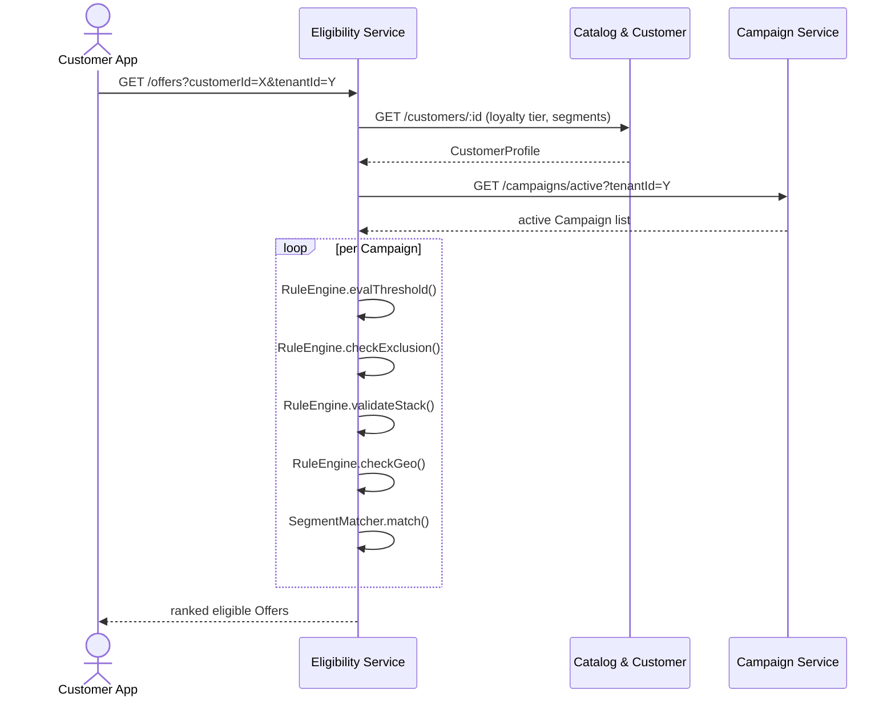
```mermaid
sequenceDiagram
    actor CX as Customer App
    participant ES as Eligibility Service
    participant CCS as Catalog & Customer
    participant CS as Campaign Service

    CX->>ES: GET /offers?customerId=X&tenantId=Y
    ES->>CCS: GET /customers/:id (loyalty tier, segments)
    CCS-->>ES: CustomerProfile
    ES->>CS: GET /campaigns/active?tenantId=Y
    CS-->>ES: active Campaign list
    loop per Campaign
        ES->>ES: RuleEngine.evalThreshold()
        ES->>ES: RuleEngine.checkExclusion()
        ES->>ES: RuleEngine.validateStack()
        ES->>ES: RuleEngine.checkGeo()
        ES->>ES: SegmentMatcher.match()
    end
    ES-->>CX: ranked eligible Offers
```

---

### Sequence 3 — Offer Redemption

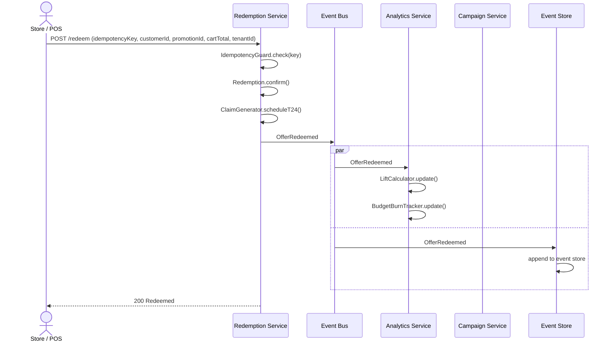
```mermaid
sequenceDiagram
    actor POS as Store / POS
    participant RS as Redemption Service
    participant EB as Event Bus
    participant AS as Analytics Service
    participant CS as Campaign Service
    participant EVS as Event Store

    POS->>RS: POST /redeem (idempotencyKey, customerId, promotionId, cartTotal, tenantId)
    RS->>RS: IdempotencyGuard.check(key)
    RS->>RS: Redemption.confirm()
    RS->>RS: ClaimGenerator.scheduleT24()
    RS->>EB: OfferRedeemed
    par
        EB->>AS: OfferRedeemed
        AS->>AS: LiftCalculator.update()
        AS->>AS: BudgetBurnTracker.update()
    and
        EB->>EVS: OfferRedeemed
        EVS->>EVS: append to event store
    end
    RS-->>POS: 200 Redeemed
```

---

### Sequence 4 — Budget Exhaustion Auto-Pause

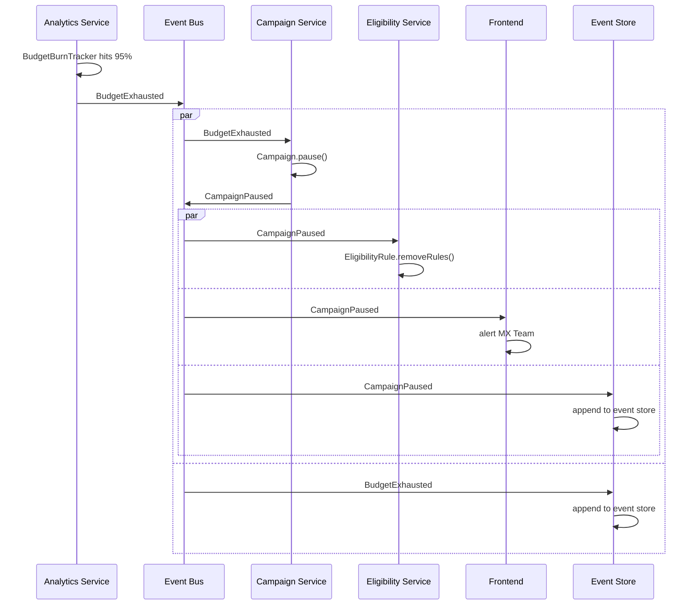
```mermaid
sequenceDiagram
    participant AS as Analytics Service
    participant EB as Event Bus
    participant CS as Campaign Service
    participant ES as Eligibility Service
    participant FE as Frontend
    participant EVS as Event Store

    AS->>AS: BudgetBurnTracker hits 95%
    AS->>EB: BudgetExhausted
    par
        EB->>CS: BudgetExhausted
        CS->>CS: Campaign.pause()
        CS->>EB: CampaignPaused
        par
            EB->>ES: CampaignPaused
            ES->>ES: EligibilityRule.removeRules()
        and
            EB->>FE: CampaignPaused
            FE->>FE: alert MX Team
        and
            EB->>EVS: CampaignPaused
            EVS->>EVS: append to event store
        end
    and
        EB->>EVS: BudgetExhausted
        EVS->>EVS: append to event store
    end
```

---

### Sequence 5 — Contract Skill Handoff Between Teams

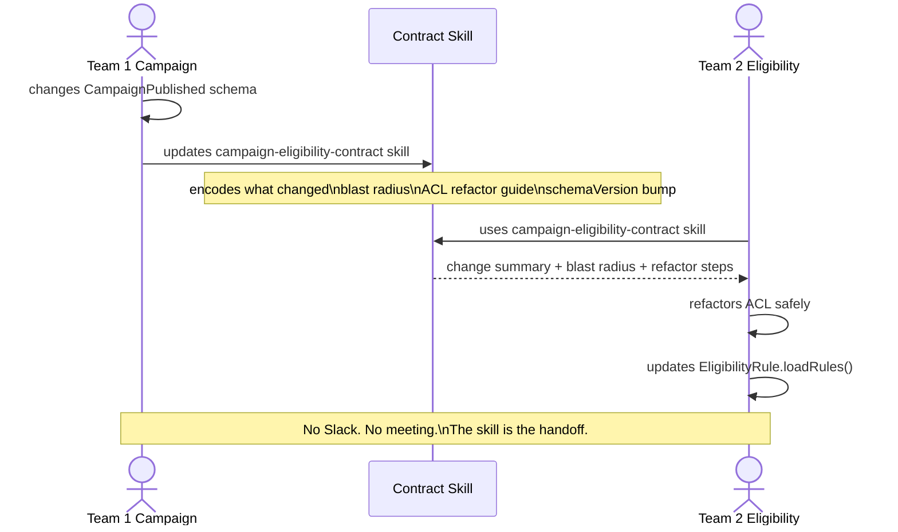
```mermaid
sequenceDiagram
    actor T1 as Team 1 Campaign
    participant SK as Contract Skill
    actor T2 as Team 2 Eligibility

    T1->>T1: changes CampaignPublished schema
    T1->>SK: updates campaign-eligibility-contract skill
    Note over SK: encodes what changed\nblast radius\nACL refactor guide\nschemaVersion bump

    T2->>SK: uses campaign-eligibility-contract skill
    SK-->>T2: change summary + blast radius + refactor steps
    T2->>T2: refactors ACL safely
    T2->>T2: updates EligibilityRule.loadRules()
    Note over T1,T2: No Slack. No meeting.\nThe skill is the handoff.
```

---

### Sequence 6 — Full SDD Flow Per Team

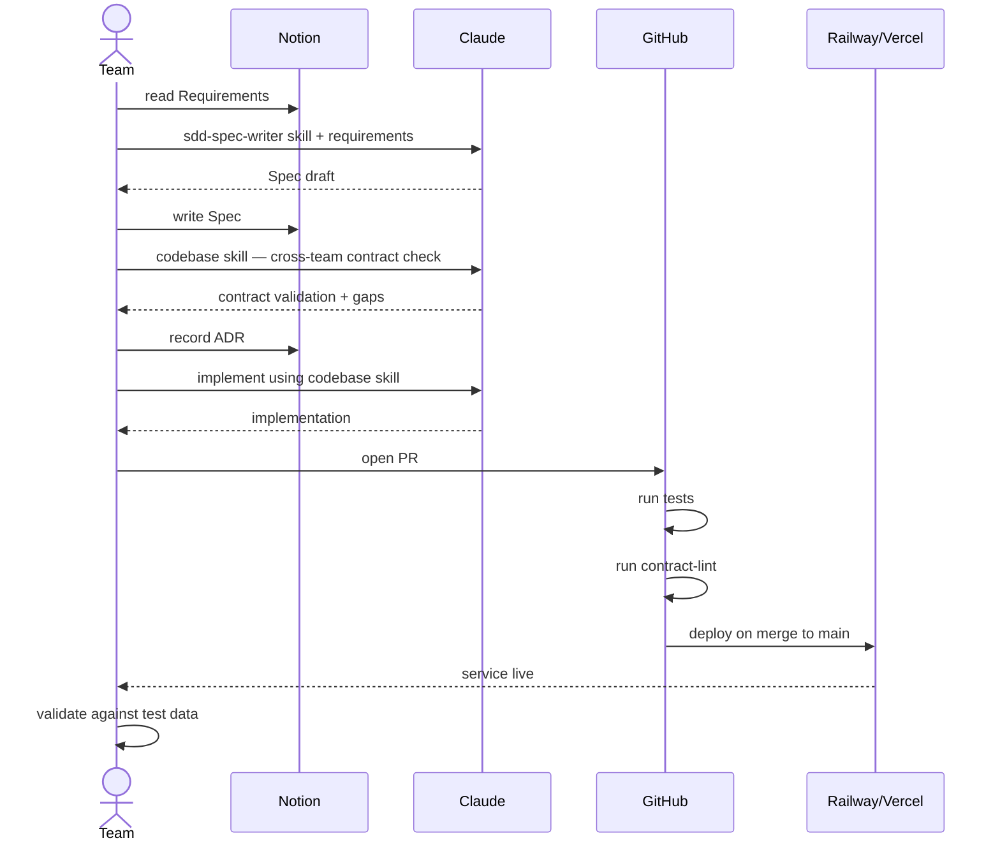
```mermaid
sequenceDiagram
    actor Team
    participant Notion
    participant Claude
    participant GH as GitHub
    participant RW as Railway/Vercel

    Team->>Notion: read Requirements
    Team->>Claude: sdd-spec-writer skill + requirements
    Claude-->>Team: Spec draft
    Team->>Notion: write Spec
    Team->>Claude: codebase skill — cross-team contract check
    Claude-->>Team: contract validation + gaps
    Team->>Notion: record ADR
    Team->>Claude: implement using codebase skill
    Claude-->>Team: implementation
    Team->>GH: open PR
    GH->>GH: run tests
    GH->>GH: run contract-lint
    GH->>RW: deploy on merge to main
    RW-->>Team: service live
    Team->>Team: validate against test data
```

---

## Deployment Topology

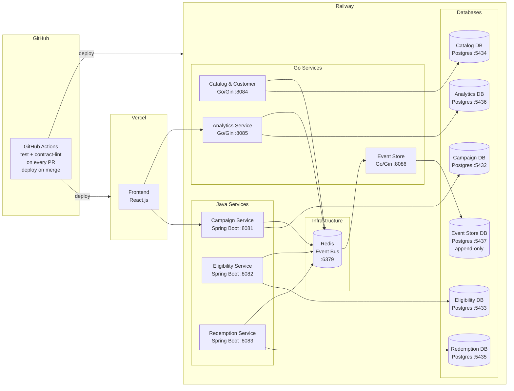
```mermaid
graph LR
    subgraph GitHub
        GH["GitHub Actions\ntest + contract-lint\non every PR\ndeploy on merge"]
    end

    subgraph Vercel
        FE["Frontend\nReact.js"]
    end

    subgraph Railway
        subgraph Java Services
            CS["Campaign Service\nSpring Boot :8081"]
            ES["Eligibility Service\nSpring Boot :8082"]
            RS["Redemption Service\nSpring Boot :8083"]
        end

        subgraph Go Services
            CCS["Catalog & Customer\nGo/Gin :8084"]
            AS["Analytics Service\nGo/Gin :8085"]
            EVS["Event Store\nGo/Gin :8086"]
        end

        subgraph Infrastructure
            EB[("Redis\nEvent Bus\n:6379")]
        end

        subgraph Databases
            DB1[("Campaign DB\nPostgres :5432")]
            DB2[("Eligibility DB\nPostgres :5433")]
            DB3[("Catalog DB\nPostgres :5434")]
            DB4[("Redemption DB\nPostgres :5435")]
            DB5[("Analytics DB\nPostgres :5436")]
            DB6[("Event Store DB\nPostgres :5437\nappend-only")]
        end
    end

    GH -->|deploy| Vercel
    GH -->|deploy| Railway

    FE --> CS
    FE --> AS

    CS --> DB1
    CS --> EB
    ES --> DB2
    ES --> EB
    RS --> DB4
    RS --> EB
    CCS --> DB3
    CCS --> EB
    AS --> DB5
    AS --> EB
    EVS --> DB6
    EB --> EVS
```

---

## SaaS-Ready Design

Every entity and event carries `tenantId`. Isolation is enforced at the application layer now, database-level row security in production.

```
Future SaaS additions (post-session):
├── Tenant onboarding flow
├── Subdomain routing (kroger.promotionos.com)
├── Stripe billing integration
└── PostgreSQL Row Level Security per tenantId
```

---

## AI / ML Readiness

The Event Store is the AI pipeline foundation. No ETL required.

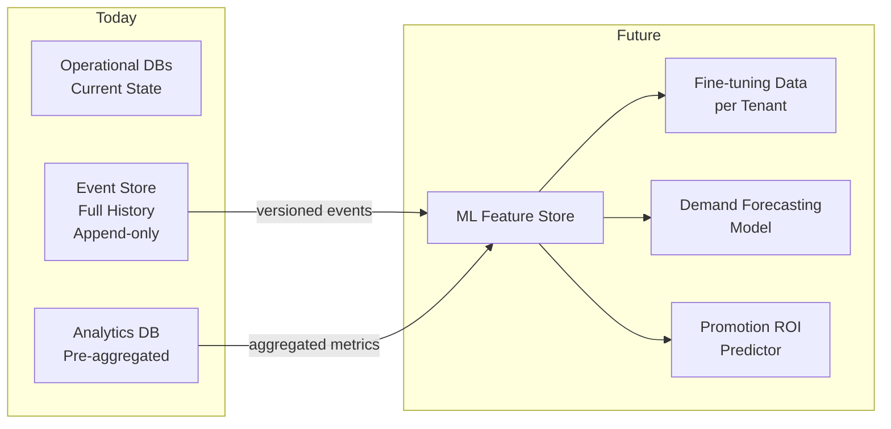
```mermaid
graph LR
    subgraph Today
        OPS["Operational DBs\nCurrent State"]
        ES2["Event Store\nFull History\nAppend-only"]
        AN["Analytics DB\nPre-aggregated"]
    end

    subgraph Future
        FS["ML Feature Store"]
        FT["Fine-tuning Data\nper Tenant"]
        FC["Demand Forecasting\nModel"]
        PR["Promotion ROI\nPredictor"]
    end

    ES2 -->|versioned events| FS
    AN -->|aggregated metrics| FS
    FS --> FT
    FS --> FC
    FS --> PR
```

---

## Team → Bounded Context Assignment

| Team | Service | Language | Complexity | Bug Planted |
|------|---------|----------|------------|-------------|
| Team 1 | Campaign Service | Java / Spring Boot | High — funding, conflict, budget lifecycle | No |
| Team 2 | Eligibility Service | Java / Spring Boot | Highest — stacking, exclusions, ACL, thresholds | Yes — stack limit off-by-one |
| Team 3 | Catalog & Customer | Go / Gin | Medium — hierarchy inheritance, segment calc | Yes — exclusion inheritance bug |
| Team 4 | Redemption Service | Java / Spring Boot | High — idempotency, immutability, claim lifecycle | No |
| Team 5 | Analytics Service | Go / Gin | Medium — lift calc, real-time burn, ROI | Yes — double count on retry |
| Team 6 | Frontend Dashboard | React.js | Medium — real-time updates, MX + CX views | No |

---

## Skills Architecture

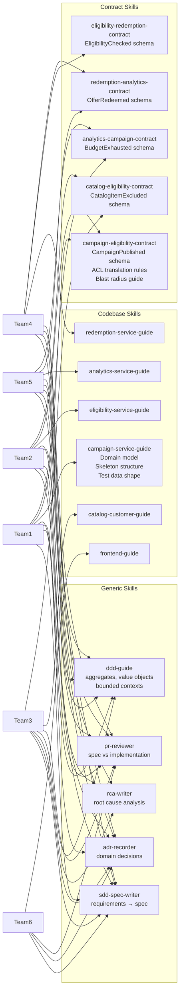
```mermaid
graph LR
    subgraph Generic Skills
        SDD["sdd-spec-writer\nrequirements → spec"]
        ADR["adr-recorder\ndomain decisions"]
        RCA["rca-writer\nroot cause analysis"]
        DDD2["ddd-guide\naggregates, value objects\nbounded contexts"]
        PRR["pr-reviewer\nspec vs implementation"]
    end

    subgraph Codebase Skills
        CS_SK["campaign-service-guide\nDomain model\nSkeleton structure\nTest data shape"]
        ES_SK["eligibility-service-guide"]
        CCS_SK["catalog-customer-guide"]
        RS_SK["redemption-service-guide"]
        AS_SK["analytics-service-guide"]
        FE_SK["frontend-guide"]
    end

    subgraph Contract Skills
        C1["campaign-eligibility-contract\nCampaignPublished schema\nACL translation rules\nBlast radius guide"]
        C2["eligibility-redemption-contract\nEligibilityChecked schema"]
        C3["redemption-analytics-contract\nOfferRedeemed schema"]
        C4["catalog-eligibility-contract\nCatalogItemExcluded schema"]
        C5["analytics-campaign-contract\nBudgetExhausted schema"]
    end

    Team1 --> SDD & ADR & DDD2 & PRR
    Team1 --> CS_SK
    Team1 --> C1 & C5

    Team2 --> SDD & ADR & RCA & DDD2 & PRR
    Team2 --> ES_SK
    Team2 --> C1 & C4

    Team3 --> SDD & ADR & RCA & DDD2 & PRR
    Team3 --> CCS_SK
    Team3 --> C4

    Team4 --> SDD & ADR & DDD2 & PRR
    Team4 --> RS_SK
    Team4 --> C2 & C3

    Team5 --> SDD & ADR & RCA & DDD2 & PRR
    Team5 --> AS_SK
    Team5 --> C3 & C5

    Team6 --> SDD & ADR & PRR
    Team6 --> FE_SK
```
